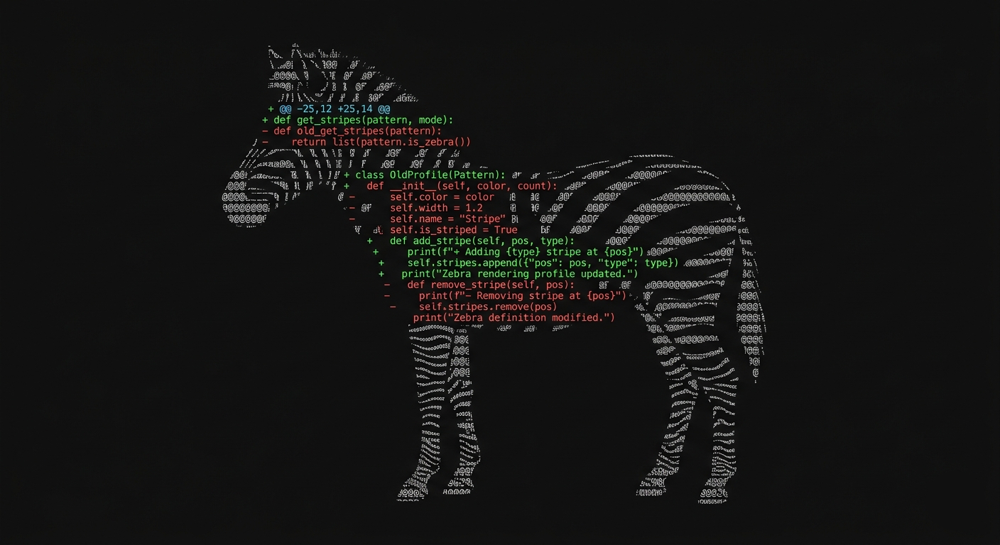

# zebra-tui

<p align="center">
  
</p>

<p align="center">
  
  <a href="LICENSE"></a>
</p>

## What it is

`zebra` is a fast, keyboard-driven terminal UI for reviewing your **local git
diffs**. It replaces the raw `git diff` output with a navigable interface: a
sidebar of changed files with status indicators and `+/-` counts, and a diff
panel with line numbers, inline or side-by-side layout, visible whitespace, and
in-diff search, all without leaving the terminal. It shells out to the `git`
binary and opens instantly in the current repository.

It scratches a personal itch: not wanting to depend on a heavyweight IDE just to
read a diff, while the terminal alternative, a bare `git diff`, is ugly and
incomplete (no line numbers, no side-by-side, no whitespace visibility, no
way to jump between files). `zebra` makes reviewing changes a first-class
terminal experience. For the full design, covering layers, data model, and
rendering strategy, see [`docs/ARCHITECTURE.md`](docs/ARCHITECTURE.md).

## Key features

- **File sidebar**: every changed file with status (`M`/`A`/`D`/`R`), color-coded, and per-file `+N -N` counts.
- **Inline & side-by-side**: toggle layouts on the same diff; side-by-side keeps independent old/new line numbers.
- **Scopes**: switch between working tree, staged, and working tree + staged without restarting.
- **Visible whitespace**: render spaces as `·` and tabs as `→`, and highlight whitespace-only changes.
- **In-diff search**: `Ctrl+F` highlights all matches and steps through them.
- **Sidebar filter**: the same `Ctrl+F`, when the sidebar is focused, filters the file list.
- **Hunk navigation**: jump between hunks with `n` / `p` to skip unchanged context.
- **Binary & empty states**: binary files show sizes (`24KB → 31KB`); a clean tree says so instead of crashing.
- **Instant**: the first diff is loaded before the first frame is drawn.

## Use cases

- **Pre-commit self-review**: read exactly what you're about to commit, staged vs. unstaged, before you push.
- **Terminal-only workflows**: review changes over SSH or in a tmux pane without opening an IDE or a browser.
- **Spotting formatting noise**: surface whitespace-only changes that hide real edits in a normal diff.
- **Large changesets**: filter the file list and hop between hunks instead of scrolling a wall of `git diff`.

## Quick start

The shortest path to a running `zebra`.

### npm

No Go toolchain required:

```sh
npm install -g zebra-tui
```

This downloads the prebuilt binary for your platform from the latest
[GitHub Release](https://github.com/natansalvadorligabo/zebra-tui/releases) and
installs a `zebra` command. Requires Node 18+ and `git` on your `PATH`.

### From source

Requires [Go 1.26+](https://go.dev/dl/).

```sh
go install github.com/natansalvadorligabo/zebra-tui@latest
```

This drops a `zebra` binary in `$(go env GOPATH)/bin`. Make sure that directory
is on your `PATH`.

Or build a local checkout:

```sh
git clone https://github.com/natansalvadorligabo/zebra-tui.git
cd zebra-tui
go build -o zebra .
```

### Windows

```powershell
go install github.com/natansalvadorligabo/zebra-tui@latest
# produces zebra.exe in %GOPATH%\bin (usually %USERPROFILE%\go\bin)
```

Pre-built `zebra-windows-amd64.exe` binaries will be attached to each
[GitHub Release](https://github.com/natansalvadorligabo/zebra-tui/releases).

### Linux

```sh
go install github.com/natansalvadorligabo/zebra-tui@latest
# or grab a pre-built binary from the Releases page:
# curl -L -o zebra https://github.com/natansalvadorligabo/zebra-tui/releases/latest/download/zebra-linux-amd64
# chmod +x zebra && sudo mv zebra /usr/local/bin/
```

### macOS

```sh
go install github.com/natansalvadorligabo/zebra-tui@latest
# or grab a pre-built binary (replace arm64 with amd64 on Intel Macs):
# curl -L -o zebra https://github.com/natansalvadorligabo/zebra-tui/releases/latest/download/zebra-darwin-arm64
# chmod +x zebra && sudo mv zebra /usr/local/bin/
```

### Install notes

- **`git` is required** at runtime: `zebra` shells out to it; it doesn't bundle a git library.
- `go install` needs Go on your machine; if you don't have it, use the pre-built binaries from Releases instead.
- npm (`npm install -g zebra-tui`) and pre-built binaries on the Releases page are available; Homebrew and Scoop are wired through the release pipeline and land as it matures.
- A true-color terminal gives the best result; `zebra` degrades gracefully on limited palettes.

## Usage

Run inside any git repository:

```sh
zebra
```

Review a repository elsewhere without changing directories:

```sh
zebra --repo /path/to/repo
```

### Keybindings

| Key              | Action                                             |
| ---------------- | -------------------------------------------------- |
| `Tab`            | Cycle focus (sidebar → scope → view → whitespace → diff) |
| `←` / `→`        | Move focus between sidebar and diff panel          |
| `↑`/`↓`, `j`/`k` | Move sidebar selection / scroll the diff panel     |
| `Enter`          | Open the selected file (sidebar) / activate toggle |
| `n` / `p`        | Jump to next / previous hunk                       |
| `v`              | Toggle inline ↔ side-by-side view                  |
| `w`              | Toggle visible whitespace                          |
| `Ctrl+F`         | Search the diff / filter the file list (by focus)  |
| `Esc`            | Close search or filter                             |
| `q`, `Ctrl+C`    | Quit                                               |

The top control bar shows the current scope (working tree / staged /
worktree+staged), view mode, and whitespace toggle. Focus the scope control and
press `Space`/`Enter` to cycle scopes.

## Architecture

`zebra` is split into three pure, independently tested layers, ordered by
purity, where lower layers never depend on the ones above:

- **`internal/git`**: the only code that touches the filesystem or spawns processes; runs `git diff` variants and returns *raw* output.
- **`internal/diff`**: a *pure* parser that turns raw unified-diff text into a `File → Hunk → Line` model. No I/O.
- **`internal/ui`**: the Bubble Tea model and pure render functions; `LoadFiles` is the single seam to git.

The full design, covering layer boundaries, the diff data model, focus/scroll
handling, and the inline vs. side-by-side rendering strategy, lives in
[`docs/ARCHITECTURE.md`](docs/ARCHITECTURE.md). Product requirements are in
[`docs/PRD.md`](docs/PRD.md).

## Influences and prior art

- [akitaonrails/ghpending](https://github.com/akitaonrails/ghpending): the inspiration for building this as a TUI.
- [Bubble Tea](https://github.com/charmbracelet/bubbletea) & [Lip Gloss](https://github.com/charmbracelet/lipgloss): the Charm libraries `zebra` is built on.

## License

[MIT](LICENSE)

## Acknowledgements

This codebase is being built collaboratively with Claude Code (Anthropic Claude
Opus 4.8).
